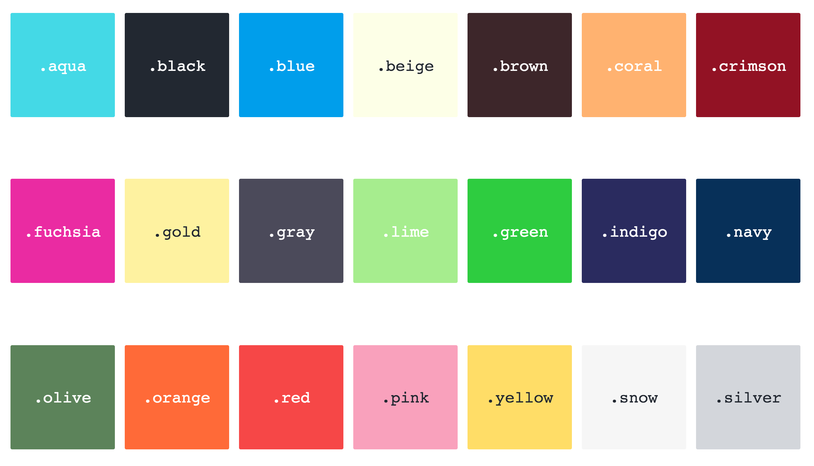

<h1 align="center">color-pal</h1>
<div align="center">
  
</div>
<br>
<div align="center">
  <a href="https://npmjs.org/package/color-pal">
    
  </a>
  <a href="https://npmjs.org/package/color-pal">
  
  </a>
  <a href="https://github.com/feross/standard">
    
  </a>
  <a href="https://travis-ci.org/tiaanduplessis/color-pal">
    
  </a>
  <a href="https://github.com/tiaanduplessis/color-pal/blob/master/LICENSE">
    
  </a>
  <a href="http://makeapullrequest.com">
    
  </a>
</div>
<br>
<div align="center">
  <a href="https://github.com/tiaanduplessis/color-pal/watchers">
    
  </a>
  <a href="https://github.com/tiaanduplessis/color-pal/stargazers">
    
  </a>
  <a href="https://twitter.com/intent/tweet?text=Check%20out%20color-pal!%20https://github.com/tiaanduplessis/color-pal%20%F0%9F%91%8D">
    
  </a>
</div>
<br>
<div align="center">
  Built with ❤︎ by <a href="https://github.com/tiaanduplessis">Tiaan</a> and <a href="https://github.com/tiaanduplessis/color-pal/graphs/contributors">contributors</a>
</div>

<h2>Table of Contents</h2>
<details>
  <summary>Table of Contents</summary>
  <li><a href="#about">About</a></li>
	<li><a href="#install">Install</a></li>
  <li><a href="#contribute">Contribute</a></li>
  <li><a href="#license">License</a></li>
</details>

## About

[](https://greenkeeper.io/)

A simple little color palette for rapid prototyping. Based and inspired by [colors](https://github.com/mrmrs/colors). Customized to my own preference.

## Install

With package manager:

```sh
$ npm install color-pal
# OR
$ yarn add color-pal
```

With CDN:

```html
<link rel="stylesheet" href="https://cdn.rawgit.com/tiaanduplessis/color-pal/master/dist/color-pal.min.css">
<!-- Or -->
<link rel="stylesheet" href="https://unpkg.com/color-pal/dist/color-pal.min.css">
```

## Contribute

Contributions are welcome. Please open up an issue or create PR if you would like to help out.

## License

MIT
